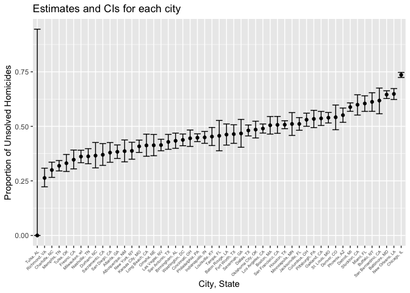
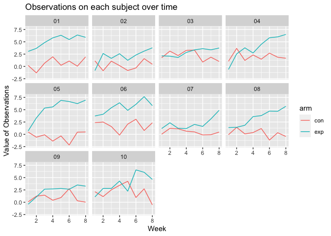

p8105_hw5_jw4489
================
2023-11-15

``` r
library(tidyverse)
library(rvest)
library(dplyr)
library(purrr)
library(tidyr)
library(broom)
```

## Problem 1

##### Describe the raw data

``` r
raw_df1 = read.csv("hw5data/homicide-data.csv")

view(raw_df1)
```

According to the raw data, we can see that it has 52179 observations,
and 12 variables in total.

``` r
df1 = raw_df1 |> 
  janitor::clean_names() |> 
  mutate(city_state = paste(city, state, sep = ", "))

view(df1)
```

``` r
df1_summarized = df1 |>
  group_by(city_state) |>
  summarize(total_homicides = n(),
             unsolved_homicides = sum(disposition %in% c("Closed without arrest", "Open/No arrest")))

df1_summarized
```

    ## # A tibble: 51 × 3
    ##    city_state      total_homicides unsolved_homicides
    ##    <chr>                     <int>              <int>
    ##  1 Albuquerque, NM             378                146
    ##  2 Atlanta, GA                 973                373
    ##  3 Baltimore, MD              2827               1825
    ##  4 Baton Rouge, LA             424                196
    ##  5 Birmingham, AL              800                347
    ##  6 Boston, MA                  614                310
    ##  7 Buffalo, NY                 521                319
    ##  8 Charlotte, NC               687                206
    ##  9 Chicago, IL                5535               4073
    ## 10 Cincinnati, OH              694                309
    ## # ℹ 41 more rows

##### Estimate the proportion of homicides that are unsolve

``` r
baltimore_prop_test = 
  prop.test(df1_summarized |>
            filter(city_state == "Baltimore, MD") |>
            pull(unsolved_homicides),
            df1_summarized |>
            filter(city_state == "Baltimore, MD") |>
            pull(total_homicides))

baltimore_tidy = baltimore_prop_test |>
  broom::tidy()

baltimore_tidy
```

    ## # A tibble: 1 × 8
    ##   estimate statistic  p.value parameter conf.low conf.high method    alternative
    ##      <dbl>     <dbl>    <dbl>     <int>    <dbl>     <dbl> <chr>     <chr>      
    ## 1    0.646      239. 6.46e-54         1    0.628     0.663 1-sample… two.sided

``` r
estimate = baltimore_tidy |>
  pull(estimate)
conf_low = baltimore_tidy |>
  pull(conf.low)
conf_high = baltimore_tidy |>
  pull(conf.high)
```

Hence the estimated proportion is 0.6455607, and the confidence interval
is (0.6275625, 0.6631599).

##### Run prop.test for each of the cities in the dataset

``` r
all_city_test = df1_summarized |>
  janitor::clean_names() |>
  mutate(prop_test_all = purrr::map2(unsolved_homicides, total_homicides, \(x, y) prop.test(x = x, n = y)),
         prop_test_tidy = purrr::map(prop_test_all, broom::tidy)) |> 
  select(- prop_test_all) |>
  unnest(prop_test_tidy) |>
  janitor::clean_names() |>
  select(city_state, estimate, conf_low, conf_high) |>
  mutate(city_state = fct_reorder(city_state, estimate))
```

    ## Warning: There was 1 warning in `mutate()`.
    ## ℹ In argument: `prop_test_all = purrr::map2(...)`.
    ## Caused by warning in `prop.test()`:
    ## ! Chi-squared approximation may be incorrect

``` r
all_city_test
```

    ## # A tibble: 51 × 4
    ##    city_state      estimate conf_low conf_high
    ##    <fct>              <dbl>    <dbl>     <dbl>
    ##  1 Albuquerque, NM    0.386    0.337     0.438
    ##  2 Atlanta, GA        0.383    0.353     0.415
    ##  3 Baltimore, MD      0.646    0.628     0.663
    ##  4 Baton Rouge, LA    0.462    0.414     0.511
    ##  5 Birmingham, AL     0.434    0.399     0.469
    ##  6 Boston, MA         0.505    0.465     0.545
    ##  7 Buffalo, NY        0.612    0.569     0.654
    ##  8 Charlotte, NC      0.300    0.266     0.336
    ##  9 Chicago, IL        0.736    0.724     0.747
    ## 10 Cincinnati, OH     0.445    0.408     0.483
    ## # ℹ 41 more rows

##### Create the plot

``` r
test_plot = all_city_test |>
  ggplot(aes(x = city_state, y = estimate)) + 
  geom_errorbar(aes(ymin = conf_low, ymax = conf_high)) +
  geom_point() +
  labs(title = "Estimates and CIs for each city",
       x = "City, State",
       y = "Proportion of Unsolved Homicides") +
  theme(axis.text.x = element_text(size = 5, angle = 45, hjust = 1))

test_plot
```

<!-- -->

## Problem 2

##### Create a tidy dataframe containing data from all participants

``` r
file_names = list.files("./hw5data/hw5p2", pattern = "*.csv")
```

``` r
df2 = data.frame(file_names = file_names) |>
  mutate(data = map(file_names, ~read.csv(paste0("./hw5data/hw5p2", "/", .x)))) |>
  unnest(data) 
```

``` r
df2_tidy = df2 |>
  mutate(subject_id = str_extract(file_names, "\\d+"),
         arm = str_extract(file_names, "^[a-z]*")) |>
  select(- file_names) |>
  select(subject_id, arm, everything()) |>
  pivot_longer(cols = starts_with("week_"),
               names_to = "week",
               values_to = "observations") |>
  mutate(week = as.numeric(substr(week, 6, 7)))

df2_tidy 
```

    ## # A tibble: 160 × 4
    ##    subject_id arm    week observations
    ##    <chr>      <chr> <dbl>        <dbl>
    ##  1 01         con       1         0.2 
    ##  2 01         con       2        -1.31
    ##  3 01         con       3         0.66
    ##  4 01         con       4         1.96
    ##  5 01         con       5         0.23
    ##  6 01         con       6         1.09
    ##  7 01         con       7         0.05
    ##  8 01         con       8         1.94
    ##  9 02         con       1         1.13
    ## 10 02         con       2        -0.88
    ## # ℹ 150 more rows

##### Make the spaghetti plot

``` r
df2_plot = df2_tidy |>
  ggplot(aes(x = week, y = observations, color = arm)) +
  geom_line() +
  facet_wrap(~ subject_id) +
  labs(title = "Observations on each subject over time",
       x = "Week",
       y = "Value of Observations")

df2_plot
```

<!-- -->

According to the plots generated, we can see that, the experimental
group shows an increasing pattern overall, but the controlled group
doesn’t have any trends or patterns. Besides, we can also conclude that
for most of the participants, the experimental group tends to have
higher values than the controlled group.
